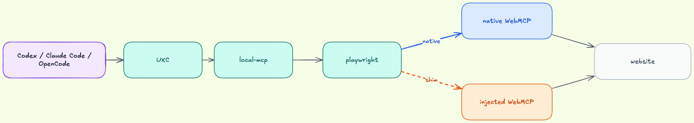

# board

Native WebMCP example app for `webmcp-bridge`.

This example is not an adapter. It is a browser app that exposes `navigator.modelContext` directly and lets a human and an AI edit the same diagram together.

## Run

```bash
pnpm install
pnpm --filter @webmcp-bridge/example-board dev
```

The app serves on `http://127.0.0.1:4173`.

## Deploy

Cloudflare Pages is the intended deployment target for the public demo at `https://board.holon.run`.

```bash
pnpm --filter @webmcp-bridge/example-board build
pnpm --filter @webmcp-bridge/example-board deploy:pages
```

The Pages project name is pinned as `board` in [wrangler.jsonc](/Users/jolestar/opensource/src/github.com/holon-run/webmcp-bridge/examples/board/wrangler.jsonc).

## Connect From local-mcp

Architecture overview:



Public deployment:

```bash
node packages/local-mcp/dist/cli.js --url https://board.holon.run --headless
```

Local development:

```bash
node packages/local-mcp/dist/cli.js --url http://127.0.0.1:4173 --headless
```

Reveal the shared headed browser session before live collaboration:

```bash
board-webmcp-ui bridge.open
```

## WebMCP Tools

- `nodes.list`
- `nodes.upsert`
- `nodes.style`
- `nodes.resize`
- `nodes.remove`
- `edges.list`
- `edges.upsert`
- `edges.style`
- `edges.remove`
- `layout.apply`
- `canvas.style`
- `view.fit`
- `diagram.get`
- `diagram.setTitle`
- `diagram.loadDemo`
- `diagram.reset`
- `diagram.export`
- `selection.get`
- `selection.remove`

## Notes

- Diagram state persists in browser `localStorage`.
- The default diagram title is `Board WebMCP Demo`, and `diagram.setTitle` updates the exported filename/title metadata.
- The page provides its own `navigator.modelContext` implementation so it also works in standard browsers.
- This example demonstrates a native WebMCP provider; it does not use `adapter-*`.
