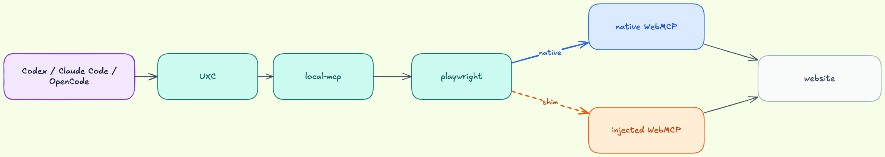

# board

Native WebMCP example app for `webmcp-bridge`.

This example is not an adapter. It is a browser app that exposes `navigator.modelContext` directly and lets a human and an AI edit the same diagram together.

## Agent Skills

If your agent workflow uses `skills`, install the required skills first:

```bash
npx -y skills@latest add holon-run/uxc --skill uxc
npx -y skills@latest add holon-run/webmcp-bridge --skill board-webmcp
```

Recommended:

```bash
npx -y skills@latest add holon-run/webmcp-bridge --skill webmcp-bridge
```

These commands do not pin `--agent`, so you can choose the target agent during installation.

`board-webmcp` depends on `uxc` because it creates and uses stable `uxc link` commands such as `board-webmcp-cli` and `board-webmcp-ui`.

## Run

```bash
pnpm install
pnpm --filter @webmcp-bridge/example-board dev
```

The app serves on `http://127.0.0.1:4173`.

## Deploy

Cloudflare Pages is the intended deployment target for the public demo at `https://board.holon.run`.

```bash
pnpm --filter @webmcp-bridge/example-board build
pnpm --filter @webmcp-bridge/example-board deploy:pages
```

The Pages project name is pinned as `board` in [wrangler.jsonc](/Users/jolestar/opensource/src/github.com/holon-run/webmcp-bridge/examples/board/wrangler.jsonc).

## Connect From local-mcp

Architecture overview:



Public deployment:

```bash
node packages/local-mcp/dist/cli.js --url https://board.holon.run --headless
```

Local development:

```bash
node packages/local-mcp/dist/cli.js --url http://127.0.0.1:4173 --headless
```

Reveal the shared headed browser session before live collaboration:

```bash
board-webmcp-ui bridge.open
```

If the user closes that window manually, the headed owner session ends. Run `board-webmcp-ui bridge.open` again to start a new headed session on the same profile.

`--headless` here is a preferred runtime mode for the managed bridge session; use `bridge.session.status` to inspect the actual active presentation mode.

## Collaborate With AI

This demo is meant to be edited by a human in the browser while an AI edits the same board through `local-mcp`.

When the human and the AI are sharing the same visible board session, use `board-webmcp-ui` for all MCP calls in that session. Do not mix `board-webmcp-cli` into the same profile at the same time.

Typical flow in Codex / Claude Code:

1. Open a visible board session:

   ```bash
   board-webmcp-ui bridge.open
   ```

2. Read the current board state:

   ```bash
   board-webmcp-ui diagram.get
   board-webmcp-ui nodes.list
   board-webmcp-ui edges.list
   ```

3. Let the human select or move content in the page, then let the AI inspect or update it:

   ```bash
   board-webmcp-ui selection.get
   board-webmcp-ui selection.remove
   board-webmcp-ui nodes.upsert '{"nodes":[{"id":"idea","label":"New Idea","kind":"service","x":480,"y":220}]}'
   board-webmcp-ui edges.upsert '{"edges":[{"id":"idea-link","sourceNodeId":"uxc","targetNodeId":"idea","label":"draft"}]}'
   board-webmcp-ui layout.apply mode=layered
   ```

4. When the user closes the visible window manually, start a new headed session on the same profile:

   ```bash
   board-webmcp-ui bridge.open
   ```

Useful collaboration tools:

- `bridge.open` / `bridge.close`
- `bridge.session.mode.get` / `bridge.session.mode.set`
- `diagram.get` / `diagram.loadDemo` / `diagram.setTitle`
- `selection.get` / `selection.remove`
- `nodes.*`
- `edges.*`
- `layout.apply`
- `view.fit`

## WebMCP Tools

- `nodes.list`
- `nodes.upsert`
- `nodes.style`
- `nodes.resize`
- `nodes.remove`
- `edges.list`
- `edges.upsert`
- `edges.style`
- `edges.remove`
- `layout.apply`
- `canvas.style`
- `view.fit`
- `diagram.get`
- `diagram.setTitle`
- `diagram.loadDemo`
- `diagram.reset`
- `diagram.export`
- `selection.get`
- `selection.remove`

## Notes

- Diagram state persists in browser `localStorage`.
- The default diagram title is `Board WebMCP Demo`, and `diagram.setTitle` updates the exported filename/title metadata.
- The page provides its own `navigator.modelContext` implementation so it also works in standard browsers.
- This example demonstrates a native WebMCP provider; it does not use `adapter-*`.
